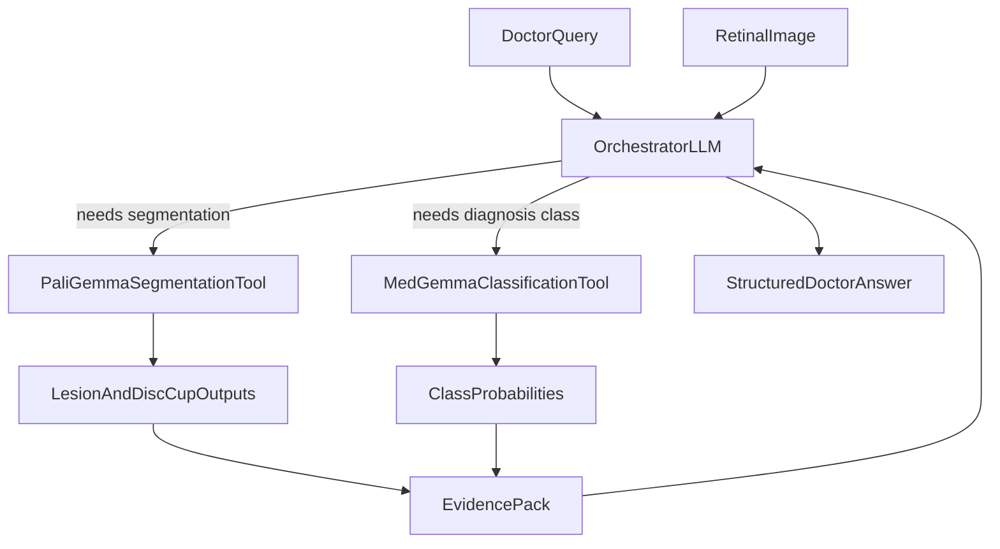

# Ophthalmology Assistant Plan

## Goal

Deliver a doctor-facing Q&A assistant that can:

- Run **lesion segmentation** and **disc/cup segmentation** via fine-tuned PaliGemma
- Run **classification** via MedGemma (no fine-tuning)
- Return clinically structured answers with visual evidence and confidence

## Proposed Project Structure

- Orchestrator/API: `[/Users/krishnaadithya/Desktop/dev/hackathon/teamlastmin/app/orchestrator.py](/Users/krishnaadithya/Desktop/dev/hackathon/teamlastmin/app/orchestrator.py)`
- Vision tool wrappers: `[/Users/krishnaadithya/Desktop/dev/hackathon/teamlastmin/app/tools/segmentation_tool.py](/Users/krishnaadithya/Desktop/dev/hackathon/teamlastmin/app/tools/segmentation_tool.py)`, `[/Users/krishnaadithya/Desktop/dev/hackathon/teamlastmin/app/tools/classification_tool.py](/Users/krishnaadithya/Desktop/dev/hackathon/teamlastmin/app/tools/classification_tool.py)`
- PaliGemma training: `[/Users/krishnaadithya/Desktop/dev/hackathon/teamlastmin/training/paligemma_finetune.py](/Users/krishnaadithya/Desktop/dev/hackathon/teamlastmin/training/paligemma_finetune.py)`
- Dataset manifest + splits: `[/Users/krishnaadithya/Desktop/dev/hackathon/teamlastmin/data/manifest.json](/Users/krishnaadithya/Desktop/dev/hackathon/teamlastmin/data/manifest.json)`
- Evaluation scripts: `[/Users/krishnaadithya/Desktop/dev/hackathon/teamlastmin/eval/segmentation_eval.py](/Users/krishnaadithya/Desktop/dev/hackathon/teamlastmin/eval/segmentation_eval.py)`, `[/Users/krishnaadithya/Desktop/dev/hackathon/teamlastmin/eval/classification_eval.py](/Users/krishnaadithya/Desktop/dev/hackathon/teamlastmin/eval/classification_eval.py)`
- Minimal demo UI: `[/Users/krishnaadithya/Desktop/dev/hackathon/teamlastmin/app/ui.py](/Users/krishnaadithya/Desktop/dev/hackathon/teamlastmin/app/ui.py)`

## System Flow

## Implementation Steps

1. **Data contract + preprocessing**
  - Standardize image format, mask format, and metadata fields (patient_id removed/anonymized).
  - Build train/val/test splits and one manifest consumed by both training and inference.
2. **Fine-tune PaliGemma for two segmentation tasks**
  - Multi-task prompt format (lesion vs disc/cup) with task-conditioned outputs.
  - Use checkpointing + early stopping; track Dice/IoU per task.
  - Export one inference-ready local checkpoint.
3. **Integrate MedGemma classification (as-is)**
  - Define fixed prompt template and output schema (class label + confidence + rationale).
  - Add calibration step on validation subset to set practical confidence thresholds.
4. **Build orchestration layer**
  - Tool-calling policy: when to call segmentation, classification, or both.
  - Merge tool outputs into concise clinical answer template (findings, confidence, next action suggestion).
  - Add guardrails: uncertainty handling and explicit non-diagnostic disclaimer for demo safety.
5. **Evaluation + demo readiness**
  - Segmentation: Dice/IoU for lesion and cup/disc regions.
  - Classification: accuracy/F1/AUROC where applicable.
  - End-to-end test set of doctor-style questions with image cases and expected response format.
6. **Local deployment for hackathon**
  - Single command launch script for local GPU inference.
  - Cache model weights and warmup path to reduce first-response latency.
  - Prepare fallback mode (classification-only) if segmentation inference is slow.

## Acceptance Criteria

- PaliGemma local checkpoint produces lesion + disc/cup masks on held-out data.
- MedGemma inference returns stable class outputs in structured JSON.
- Orchestrator can answer at least 10 representative ophthalmology queries end-to-end with image-backed evidence.
- Demo runs fully on local GPU with acceptable latency for live interaction.

## Risks and Mitigations

- **Segmentation quality risk**: use task-balanced sampling and per-task validation monitoring.
- **Latency risk on local GPU**: quantize where possible and pre-warm models.
- **Hallucination risk in doctor Q&A**: force answer grounding from tool outputs, never free-form diagnosis without evidence.
- **Data leakage/privacy risk**: enforce anonymization in manifest and logs.

